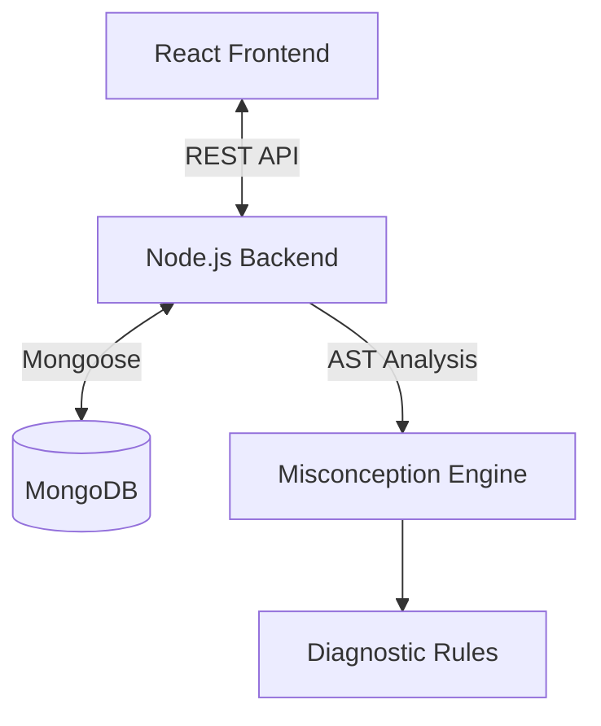

# 🧠 CodeInsight: Intelligent Learning Analytics Platform


**CodeInsight** is a next-generation coding education platform that goes beyond simple test-case validation. It uses **Static Analysis (AST)** and **Machine Learning** to detect *conceptual misconceptions* in student code (e.g., "Missing Return", "State Mutation", "Conditional Reasoning Errors") and provides actionable, educational feedback.

---

## 🚀 Key Features

### 🔍 Deep Diagnostic Engine
Unlike LeetCode or HackerRank which only tell you *if* your code failed, CodeInsight tells you *why* your logic is flawed.
-   **8+ Cognative Traps Detected**: Identifies patterns like `Off-By-One`, `Trial & Error`, `Async Misuse`, and more.
-   **AST-Based Analysis**: Parses code structure to find hidden logic errors that pass syntax checks but fail conceptually.

### 📊 Narrative Analytics Dashboard
-   **Misconception Profile**: Tracks specific bad habits over time with "Resolved" vs "Unresolved" status.

### 💎 Premium UI/UX
-   **Glassmorphism Design**: Modern, dark-themed UI with frosted glass effects.
-   **Split-Screen IDE**: Large, syntax-highlighted editor with real-time feedback.
-   **Interactive Reports**: Educational cards with "How to Fix" examples.

---

## 🛠️ Technology Stack

| Component | Tech | Description |
|-----------|------|-------------|
| **Frontend** | React, React Router | Glassmorphic UI, State Management, API Integration |
| **Backend** | Node.js, Express | REST API, AST Analysis (Acorn), Secure VM Test Runner |
| **Database** | MongoDB | Stores User Profiles, Submissions, and Analytics |

---

## 🏗️ Architecture



---

## ⚡ Getting Started

### Prerequisites
-   Node.js (v16+)
-   MongoDB (Local or Atlas)

### 1. Clone the Repository
```bash
git clone https://github.com/yourusername/codeinsight.git
cd codeinsight
```

### 2. Setup Backend
```bash
cd backend
npm install
# Create .env file with:
# MONGODB_URI=mongodb://localhost:27017/codeinsight
# JWT_SECRET=your_secret_key
# ML_SERVICE_URL=http://localhost:8000
npm start
```
*Server runs on `http://localhost:5000`*

### 3. Setup Frontend
```bash
cd frontend
npm install
npm start
```
*App runs on `http://localhost:3000`*

---

## 📸 Screenshots

### Diagnostic Report
*Real-time feedback explaining **why** the code is wrong, not just that it failed.*

### Analytics Dashboard
*Visualizing the learner's misconception profile and mastery progress.*

---

## 🤝 Contributing

1.  Fork the repository
2.  Create your feature branch (`git checkout -b feature/AmazingFeature`)
3.  Commit your changes (`git commit -m 'Add some AmazingFeature'`)
4.  Push to the branch (`git push origin feature/AmazingFeature`)
5.  Open a Pull Request
